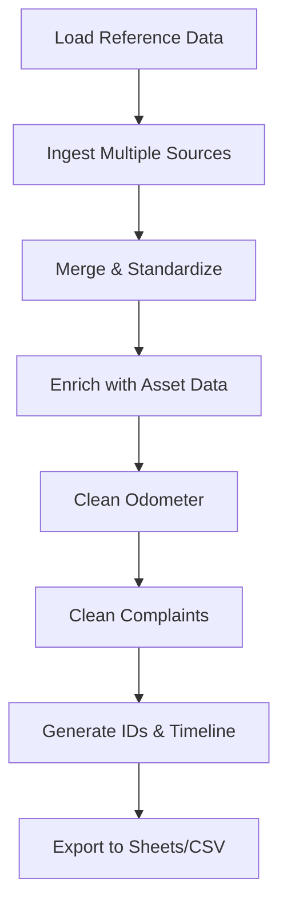

# ========================================
# my_journal - Analytics ETL Pipeline
# ========================================


Modular ETL (Extract, Transform, Load) pipeline untuk mengolah data historis servis kendaraan dari berbagai sumber Google Sheets, dengan visualisasi dashboard menggunakan Streamlit.

---

## 📋 Daftar Isi

- [Fitur Utama](#-fitur-utama)
- [Arsitektur Project](#-arsitektur-project)
- [Prerequisites](#-prerequisites)
- [Instalasi](#-instalasi)
- [Konfigurasi](#-konfigurasi)
- [Cara Menggunakan](#-cara-menggunakan)
- [Struktur Pipeline](#-struktur-pipeline)
- [Testing](#-testing)
- [Troubleshooting](#-troubleshooting)
- [Contributing](#-contributing)

---

## ✨ Fitur Utama

### Pipeline ETL
- **Modular Architecture**: Arsitektur berbasis class dengan separation of concerns
- **Multi-Source Ingestion**: Support untuk 8+ sumber data Google Sheets
- **Intelligent Data Cleaning**:
  - Fuzzy matching untuk normalisasi complaint
  - Odometer anomaly detection & imputation
  - Timeline filling dengan time travel logic
- **Retry Mechanism**: Automatic retry dengan exponential backoff untuk Google Sheets API
- **Error Handling**: Comprehensive error handling dengan specific exception types
- **Logging**: Centralized logging ke file dan console
- **Snowflake ID Generation**: Unique ID generation untuk historical data

### Dashboard
- **Interactive Visualizations**: Built with Streamlit dan Plotly
- **Multi-Page Layout**: 
  - 🏠 Home - Overview
  - 👤 About Me - Profile
  - 🚚 Fleet Analysis - Analisa armada
  - 🛠️ After Sales Analysis - Work orders & spareparts
  - 🆘 ERA Support - Emergency assistance
  - ✨ Quality Improvement - Metrics & KPIs

---

## 🏗️ Arsitektur Project

```
my_journal/
├── src/
│   ├── common/                 # Shared modules
│   │   ├── config.py          # Configuration loader (YAML + .env)
│   │   ├── data_loader.py     # Google Sheets I/O with retry
│   │   ├── utils.py           # Service utilities (format, normalize, etc)
│   │   └── logger.py          # Logging configuration
│   └── pipelines/             # ETL pipelines
│       └── work_orders/       # Work orders pipeline
│           ├── run.py         # Main runner
│           ├── transformers.py # Data transformations
│           ├── odometer_processor.py
│           └── complaint_cleaner.py
├── entrypoint/
│   └── run_pipeline.py        # CLI entrypoint
├── config/
│   └── work_orders.yaml       # Pipeline configuration
├── credentials/               # Google service account keys (gitignored)
├── output/                    # CSV output (optional)
├── logs/                      # Log files
├── tests/                     # Unit & integration tests
├── pages/                     # Streamlit dashboard pages
├── app.py                     # Streamlit main app
├── requirements.txt           # Dependencies
├── .env                       # Environment variables (gitignored)
└── .env.example               # Environment template
```

---

## 🔧 Prerequisites

- **Python**: 3.9 atau lebih tinggi
- **Google Cloud Service Account**: Dengan akses ke Google Sheets API
- **Google Sheets**: Source data yang sudah di-share ke service account email

---

## 📦 Instalasi

### 1. Clone Repository

```bash
cd C:\Users\lenov\OneDrive\Documents\my_journal
```

### 2. Buat Virtual Environment

```bash
python -m venv venv
```

### 3. Aktivasi Virtual Environment

**Windows:**
```bash
.\venv\Scripts\activate
```

**Linux/Mac:**
```bash
source venv/bin/activate
```

### 4. Install Dependencies

```bash
pip install -r requirements.txt
```

---

## ⚙️ Konfigurasi

### 1. Setup Google Service Account

1. Buat project di [Google Cloud Console](https://console.cloud.google.com/)
2. Enable **Google Sheets API**
3. Buat **Service Account** dan download JSON key
4. Simpan JSON key di folder `credentials/`

### 2. Setup Environment Variables

1. Copy `.env.example` menjadi `.env`:
   ```bash
   cp .env.example .env
   ```

2. Edit `.env` dan isi dengan nilai yang sesuai:
   ```env
   # Credentials
   GOOGLE_APPLICATION_CREDENTIALS=./credentials/seri-automation-etl.json
   
   # Google Sheets IDs (replace with your actual IDs)
   SHEET_ID_FORM_SERVICE=1uyHApnw...
   SHEET_ID_OUTPUT=1DiCivMEo...
   # ... dan seterusnya
   ```

### 3. Share Google Sheets

Share semua Google Sheets yang akan diakses dengan email service account (dapat dilihat di file JSON credentials, field `client_email`).

---

## 🚀 Cara Menggunakan

### Menjalankan Pipeline ETL

#### Via Entrypoint Script (Recommended)

```bash
# Default: menjalankan work_orders pipeline
python entrypoint/run_pipeline.py

# Spesifik pipeline
python entrypoint/run_pipeline.py --pipeline work_orders
```

#### Via Direct Module

```bash
python -m src.pipelines.work_orders.run
```

### Menjalankan Dashboard Streamlit

```bash
streamlit run app.py
```

Dashboard akan terbuka di browser pada `http://localhost:8501`

---

## 🔄 Struktur Pipeline

### Work Orders Pipeline Flow



### Key Processing Steps

1. **Ingestion**: Load data dari 8 sumber (forms, cabang, tracking)
2. **Standardization**: Normalize kolom, format plat nomor, driver category
3. **Enrichment**: Join dengan master asset (VIN, delivery date, model)
4. **Odometer Cleaning**: 
   - Detect anomalies (KM/day rules)
   - Impute missing values
   - Forward/backward fill
5. **Complaint Cleaning**: Fuzzy matching dengan master keluhan
6. **Timeline Filling**: Fill created/updated/completed timestamps
7. **Export**: Upload ke Google Sheets dan save CSV (optional)

---

## 🧪 Testing

### Run All Tests

```bash
pytest tests/
```

### Run with Coverage

```bash
pytest --cov=src tests/
```

### Test Files

- `test_transformers.py`: Unit tests untuk transformations
- `integration_test_etl.py`: Integration tests untuk pipeline

---

## 🐛 Troubleshooting

### Issue: "Service account file not found"

**Solusi:**
- Pastikan file JSON credentials ada di folder `credentials/`
- Check path di `.env` sudah benar
- Gunakan path relatif: `./credentials/your-file.json`

### Issue: "Spreadsheet not found"

**Solusi:**
- Pastikan Sheet ID di `.env` sudah benar
- Share Google Sheet dengan email service account
- Check permissions (minimal "Viewer" untuk read, "Editor" untuk write)

### Issue: "API quota exceeded"

**Solusi:**
- Pipeline sudah otomatis retry dengan exponential backoff
- Kalau masih gagal, tunggu beberapa menit lalu coba lagi
- Consider batching untuk large datasets

### Issue: "Import error" saat run pipeline

**Solusi:**
```bash
# Make sure you're in project root
cd C:\Users\lenov\OneDrive\Documents\my_journal

# Run with python -m (module mode)
python -m src.pipelines.work_orders.run
```

---

## 📊 Output

### Google Sheets Output

Pipeline akan menulis ke 3 worksheets:
1. **work_orders**: Data bisnis cleaned (untuk dashboard)
2. **cleaning_tech_log**: Technical log (odometer cleaning, complaint details)
3. **bad_data**: Rejected records (VIN tidak valid, dll)

### Local CSV Output (Optional)

Jika `SAVE_LOCAL_CSV=true` di `.env`:
- `output/final_historical_data.csv`
- `output/cleaning_tech_log.csv`
- `output/bad_data.csv`

---

## 🛠️ Development

### Adding a New Pipeline

1. Buat folder di `src/pipelines/your_pipeline/`
2. Buat file `run.py` dengan function `run_your_pipeline()`
3. Update `entrypoint/run_pipeline.py`:
   ```python
   parser.add_argument("--pipeline", choices=["work_orders", "your_pipeline", ...])
   
   if args.pipeline == "your_pipeline":
       from src.pipelines.your_pipeline.run import run_your_pipeline
       run_your_pipeline()
   ```

### Using Logger

```python
from src.common.logger import get_logger

logger = get_logger(__name__)
logger.info("Processing started")
logger.warning("Anomaly detected")
logger.error("Failed to process", exc_info=True)
```

---

## 📄 License

Private project. All rights reserved.

---

## 👤 Author

**Seri Septian**  
Analytics Engineer | Data Pipeline Specialist

---

## 📝 Changelog

### v1.0.0 (2026-01-24)
- ✅ Enhanced error handling with retry mechanism
- ✅ Added proper logging configuration
- ✅ Version pinning for all dependencies
- ✅ Comprehensive documentation

---

## 🙏 Acknowledgments

- Built with best practices from draw_project
- Inspired by modern ETL patterns
- Powered by Google Sheets API, Pandas, and Streamlit
